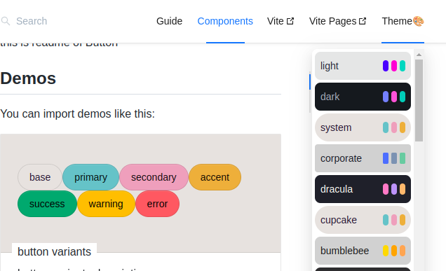

# clickable theme extends vite-pages-theme-doc


> simply customize **official theme**, extends a 
MenuConfig type 


refence:
> [where changed in source code](https://github.com/ShawSpring/vite-plugin-react-pages/blob/main/packages/theme-doc/src/Layout/renderMenu.tsx)


> [official-theme doc](https://vitejs.github.io/vite-plugin-react-pages/official-theme).  

> [vite-plugin-react-pages](https://vitejs.github.io/vite-plugin-react-pages) (vite-pages) 


## features 
customize menu item, with two features
1. click events
2. set JSX Element instead of string.
3. compitable with official theme `vite-pages-theme-doc@5.0.0`


My component library have 30+ themes, so I need the menu act as a theme selector.



## usage
> be careful, '@shawspring/vite-pages-theme-doc' replace 'vite-plugin-react-pages'
```bash
npm install -D @shawspring/vite-pages-theme-doc
```

```ts
import { createTheme } from '@shawspring/vite-pages-theme-doc'
 createTheme({
  topNavs: [
    {
      subMenu: 'themes',
      icon: '🎨',
      children: [
        {
          key: 'light',
          onclick: ({ key, domEvent }) => {
            setTheme(key) //   😕
          },
          element: <jsx-element/>, // 😽
        },
        {
          key: 'dark',
          ...
        }
        ...
      ],
    },
  ],
  ...
 })
```


## type definition
```
//packages/theme-doc/src/Layout/renderMenu.tsx
type MenuConfig =
... // original type
  | {
      readonly key: string
      readonly element: React.JSX.Element | string
      onclick?: TitleClick
    }
```

